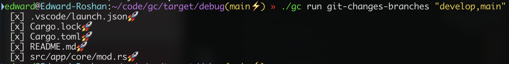
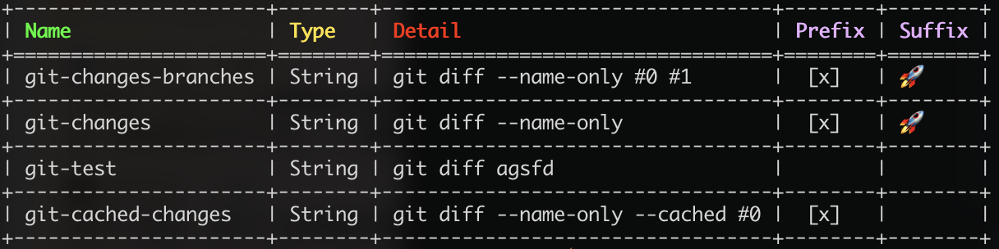
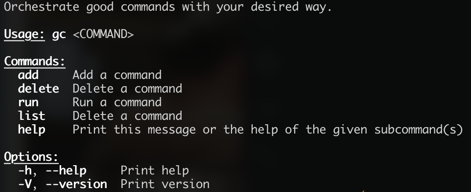

# gc (Good Commands)

Orchestrate good commands with your desired way. It's a CLI for aggregate and execute commands with command line way. "gc" means "Good Command". **(Maybe Garbage Command. LOL)**

## Usage scenario

### 1. Get changed files from git repo.

In some companies, when you create a PR for code review. Sometimes you need generate the changed files from your branch. And you need paste those stuff in the PR description. you can borrow "gc" to simplify these work.

### 2. Shorten long commands into concise commands

You can customize and aggregate long commands into small commands. all of stuff can be configurable.

## Configuration

When gc initialized, it will automatically create .gc_config file under the home path. for MacOS user, you can find from ~/.gc_config. Configuration stores with json format. can be changed manually.

```json
{
  "app": "App",
  "version": "Version",
  "source": "https://github.com/Anyone-Developers/gc",
  "commands": {
    "git-cached-changes": {
      "type": "String",
      "name": "git-cached-changes",
      "detail": "git diff --name-only --cached #0",
      "prefix": " [x] ",
      "suffix": null
    },
    "git-changes-branches": {
      "type": "String",
      "name": "git-changes-branches",
      "detail": "git diff --name-only #0 #1",
      "prefix": " [x] ",
      "suffix": "🚀"
    },
    "git-test": {
      "type": "String",
      "name": "git-test",
      "detail": "git diff agsfd",
      "prefix": null,
      "suffix": null
    },
    "git-changes": {
      "type": "String",
      "name": "git-changes",
      "detail": "git diff --name-only",
      "prefix": " [x] ",
      "suffix": "🚀"
    }
  }
}
```

## Inline commands

### add

for adding aggregated command for gc. command detail support # sign variables. It's start with 0.

for example:

```shell
gc add git-changes-branches "git diff --name-only #0 #1" --prefix=" [x] " --suffix="🚀"
```

### delete

for deleting aggregated command for gc.

for example:

```shell
gc delete git-changes-branches
```

### run

for executing aggregated command from gc.

for example

```shell
gc run git-changes-branches "develop,main"
```



### list

for listing all of commands from gc. and display them with a table.

for example:



### help

display help information.



## Planning Feature

- [ ] Support System Variables. eg. It can be setup with ${JAVA_HOME}
- [ ] Support more command types. like setup shell script. Currently, only support "String".
- [ ] Auto update CLI with inline command.
- [ ] Auto install and uninstall shell script. like nvm.
- [ ] And many unlisted features. Mail me your idea: zhang_nan_163@163.com.

## Donation

Currently, I am laid off. I need suitable job to raise my life. If you have interests to my skill, Please contact me. [zhang_nan_163@163.com](mailto:zhang_nan_163@163.com)
